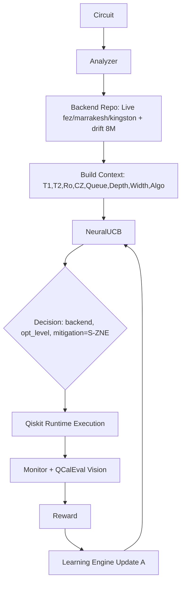

# Architecture - QuantumPilot AI

## Clean Architecture + DDD

```
Presentation (FastAPI) -> Application (UseCases) -> Domain (Entities) <- Infrastructure (Qiskit, Postgres, Redis, NeuralUCB)
```

## Modules (16)
1. Auth
2. Project Mgmt
3. Circuit Analyzer -> domain/entities/circuit.py
4. Backend Selection Engine -> infrastructure/qiskit/backend_repository.py uses live data from ibm_fez/marrakesh/kingston + 8M drift dataset
5. NeuralUCB Decision Engine -> infrastructure/ai/neuralucb/engine.py
6. Circuit Optimization (Granite 8b)
7. Error Mitigation Manager (S-ZNE, ZNE, TREX, Noise-agnostic from Nature paper)
8. Runtime Execution (Qiskit Runtime)
9. Execution Monitor (QCalEval vision)
10. Adaptive Recovery
11. Learning Engine (online update)
12. Analytics Dashboard
13. Experiment Tracking
14. API
15. Admin Dashboard
16. Notification

## Data Flow
Circuit -> Analyzer (depth,width,2q) -> BackendRepo (T1,T2,readout,cz_error,queue,calibration_age from drift_50k) -> Build 22-D Context -> NeuralUCB select arm -> Execute on IBM -> Reward -> Update A matrix

## NeuralUCB Details
- Context dim 22
- Hidden 128
- Alpha 1.0 exploration
- Uses gradient features for UCB: bonus = alpha * sqrt(g^T A^{-1} g)
- Warmup 10 random arms
- Reward = 0.5*Fidelity - 0.2*Time -0.2*Queue -0.1*Cost

## Mermaid


## Storage
- Postgres: users, projects, circuits, decisions, results
- Redis: calibration cache, queue lengths
- Parquet: drift_50k (50k rows sample of 8.04M), szne repo, qcaleval
