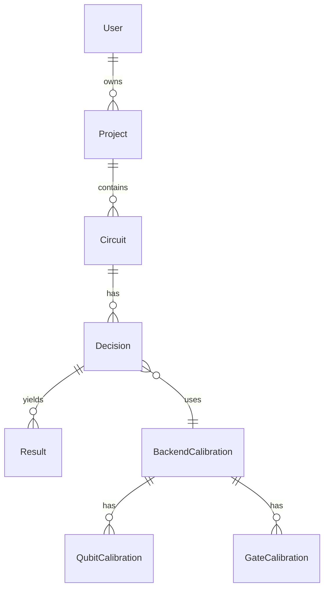

# DATABASE - QuantumPilot AI - Postgres + Redis + RabbitMQ + Parquet

## Postgres - Main DB (Port 5432)

### Tables (SQLAlchemy Models in backend/app/infrastructure/persistence/models/models.py)

#### users
- id: uuid PK
- email: unique index
- hashed_password
- full_name
- is_active, is_superuser
- created_at

#### projects
- id: uuid PK
- name, description
- owner_id FK users.id
- created_at

#### circuits - Contains Q-LEAR Features
- id: uuid PK
- project_id FK projects.id
- name
- qasm: Text (OPENQASM 3.0)
- qiskit_code: Text
- profile_json: JSON - CircuitProfile with Q-LEAR: Cw (width), Cd (depth), Gc1q (#1q), Gc2q (#2q), Dpe (depth per entanglement), critical_depth, layerwise_2q_density (NNAS), entanglement_ratio, algorithm_type VQE/QAOA, fidelity_proxy
- created_at

#### backend_calibrations - Live + Drift + Space Weather
- id: uuid PK
- backend_name: index (ibm_fez, marrakesh, kingston) - live pulled today 2026-07-11 via CRN DIGI
- num_qubits: 156
- last_update: DateTime - e.g., 2026-07-11 15:52 UTC for fez
- T1_mean: Float - e.g., 135.6us fez, 170.9 marrakesh, 231 kingston BEST, from live CSVs
- T2_mean: Float - 106.3us fez
- readout_error_mean: Float - 2.23% fez
- cz_error_mean: Float - 3.33% fez, 2.92% kingston best
- cz_error_std
- queue_length, pending_jobs: from IBM API
- calibration_age_seconds: from drift 8M dataset calibration_age_seconds
- full_properties_json: JSON - full live properties 1.1MB with qubits list T1,T2,frequency,anharmonicity,readout_error,prob_meas0_prep1 etc + gates list gate_error, gate_length
- created_at

#### execution_decisions - NeuralUCB Output
- id: uuid PK
- circuit_id FK circuits.id
- backend_name: ibm_kingston etc.
- optimization_level: 0-3
- mitigation_strategy: s_zne, zne, pec, trex, nnas, transformer, daem, avpp
- resilience_level: 0-2
- shots: 1024, 4096, 8192
- expected_fidelity: Float - from proxy (0.99^Gc1q * 0.97^Gc2q etc)
- expected_cost, expected_queue
- confidence: Float UCB confidence 0.85-0.92
- context_vector: JSON - 22-D: backend 8 (T1/300,T2/300,RO*10,CZ*10,SX*10,queue,pending,cal_age) + circuit 7 Q-LEAR + history 3 + opt/mit 2 + env 2 (kp_norm,temp_norm)
- created_at

#### execution_results - Reward for Learning
- id: uuid PK
- decision_id FK
- backend_name
- success: bool
- fidelity, hellinger_fidelity: Float - actual after execution
- execution_time_ms, queue_time_ms, cost_seconds
- counts: JSON
- error_message
- mitigation_applied: bool
- reward: Float - multi-objective: 0.5*fidelity -0.2*time -0.2*queue -0.1*cost
- created_at

### ERD Mermaid


## Redis (Port 6379) - Cache

- calibration:latest -> JSON of latest backend calibrations
- calibration:ibm_fez -> T1_mean etc
- spaceweather:latest -> Full SpaceWeatherService fetch with kp 2.0, neutron 94.6, solar 74.65°, temp 18.8C, risk Unsettled
- spaceweather:kp_norm -> 0.222
- spaceweather:cosmic_ray_strength -> 0.945
- queue:ibm_fez, queue:ibm_kingston etc.
- Rate limit keys

## RabbitMQ (5672, 15672 Management UI) - Message Broker for Celery

- Queue: celery for tasks fetch_space_weather, refresh_calibration, predict_drift
- Management: http://localhost:15672 guest/guest

## Parquet Datasets (datasets/)

- calibration_drift/drift_50k.parquet 1.8M (50k sample of 8M) - Columns: backend, property, qubit_a, value, observed_time, calibrated_time, calibration_age_seconds, is_new_measurement, latitude 41.27, longitude -73.78, solar_zenith_deg, temperature_c, pressure_hpa, humidity_pct, bz_gsm_nt, neutron_flux, kp_index, ap_index, etc.
- calibration_drift/drift_agg.csv: backend, property_family, mean, std
- calibration_drift/ibm_fez_qubits_full.csv 14K: qubit, T1, T2, readout_error, prob_meas0_prep1 etc from live fetch today
- clifford_training/clifford_training_100.json 44K + parquet 16K: depth, num_qubits, ideal_counts, noisy_counts (80% Clifford + 20% RZ)
- szne/repo/Fig2/predictions/*.npy: heisen_100q predictions 10-200 sample
- qcaleval/test-00000-of-00001.parquet 22M + fewshot 299K: 243 test images DRAG calibration NO_SIGNAL/SUCCESS with q1-q6 prompts

## Models

- models/neuralucb/reward_net.pt 26K (50 contexts MVP)
- models/neuralucb/reward_net_deep.pt 80K (8847 contexts, best val 0.0028 loss 0.3224->0.0028)
- models/neuralucb/drift_lstm.pt 21K (LSTM seq 10 -> next T1)

## Migrations - Alembic

```bash
cd backend
alembic init alembic
alembic revision --autogenerate -m "Initial: Q-LEAR features + spaceweather"
alembic upgrade head
```

## Live Data Flow

1. Celery Beat every 10 min -> fetch_space_weather task -> NOAA kp 1m API + NMDB neutron + Open-Meteo temp + solar calc -> Redis + /app/logs/spaceweather_latest.json -> Postgres backend_calibrations update kp
2. Celery Beat every 1h -> refresh_calibration -> QiskitRuntimeService CRN DIGI -> live T1/T2/RO/CZ -> Postgres
3. User creates circuit -> Analyzer -> Cw,Cd,Gc1q,Gc2q,Dpe -> profile_json
4. /decide -> builds 22-D context with live T1/T2 + kp_norm,temp_norm from Redis + Q-LEAR -> NeuralUCB select 72 arms -> Decision with context_vector JSON
5. Execution -> Result with reward -> LearningEngine updates A_grad

