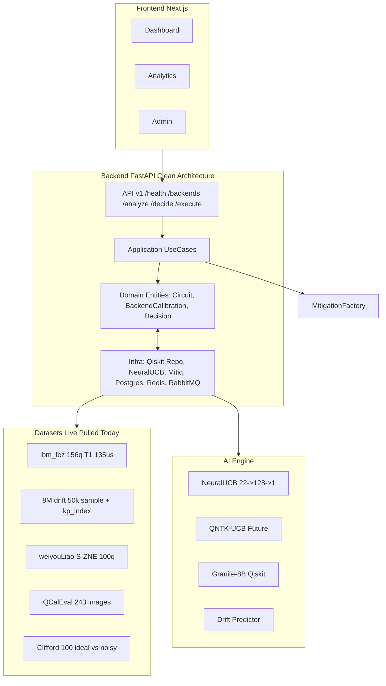
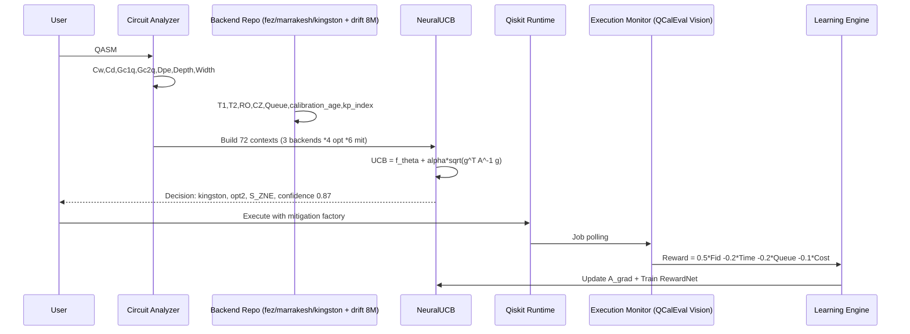
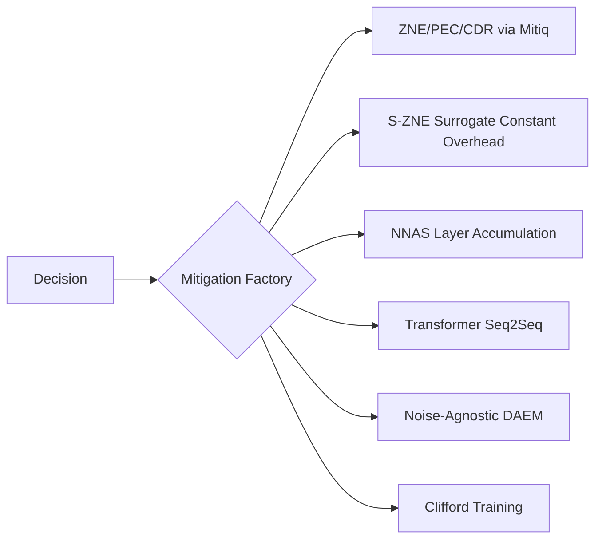
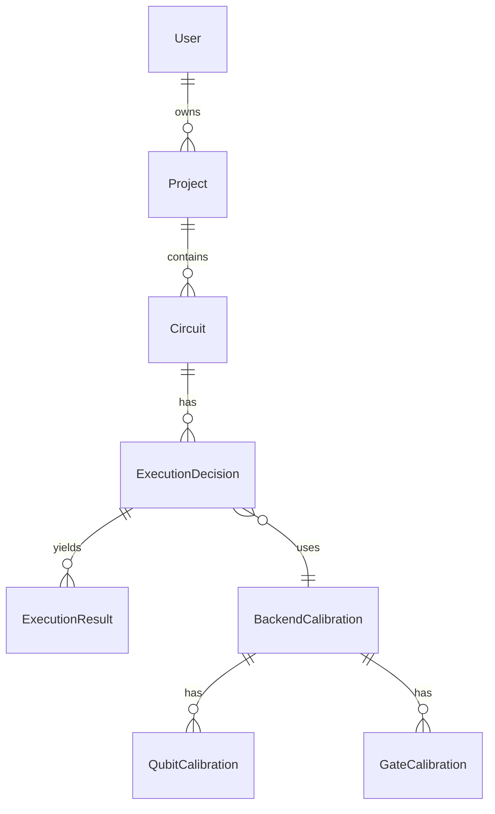
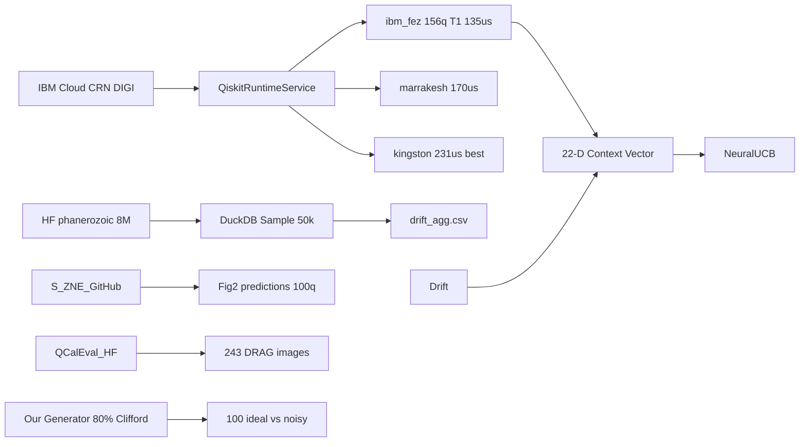

# Diagrams - Mermaid

## 1. System Architecture

```mermaid
graph TB
    subgraph Frontend [Frontend Next.js]
        Dashboard
        Analytics
        Admin
    end
    subgraph Backend [Backend FastAPI Clean Architecture]
        API[API v1 /health /backends /analyze /decide /execute]
        App[Application UseCases]
        Domain[Domain Entities: Circuit, BackendCalibration, Decision]
        Infra[Infra: Qiskit Repo, NeuralUCB, Mitiq, Postgres, Redis, RabbitMQ]
    end
    subgraph Data [Datasets Live Pulled Today]
        Live[ibm_fez 156q T1 135us]
        Drift[8M drift 50k sample + kp_index]
        SZNE[weiyouLiao S-ZNE 100q]
        QCal[QCalEval 243 images]
        Cliff[Clifford 100 ideal vs noisy]
    end
    subgraph AI [AI Engine]
        UCB[NeuralUCB 22->128->1]
        QNTK[QNTK-UCB Future]
        Granite[Granite-8B Qiskit]
        LSTM[Drift Predictor]
    end
    Frontend --> API
    API --> App --> Domain
    Domain <--> Infra
    Infra --> Data
    Infra --> AI
    App --> MitigationFactory
```

## 2. Decision Flow

```mermaid
sequenceDiagram
    participant User
    participant Analyzer as Circuit Analyzer
    participant Repo as Backend Repo (fez/marrakesh/kingston + drift 8M)
    participant UCB as NeuralUCB
    participant Exec as Qiskit Runtime
    participant Monitor as Execution Monitor (QCalEval Vision)
    participant Learn as Learning Engine

    User->>Analyzer: QASM
    Analyzer->>Analyzer: Cw,Cd,Gc1q,Gc2q,Dpe,Depth,Width
    Repo->>Repo: T1,T2,RO,CZ,Queue,calibration_age,kp_index
    Analyzer->>UCB: Build 72 contexts (3 backends *4 opt *6 mit)
    UCB->>UCB: UCB = f_theta + alpha*sqrt(g^T A^-1 g)
    UCB-->>User: Decision: kingston, opt2, S_ZNE, confidence 0.87
    User->>Exec: Execute with mitigation factory
    Exec->>Monitor: Job polling
    Monitor->>Learn: Reward = 0.5*Fid -0.2*Time -0.2*Queue -0.1*Cost
    Learn->>UCB: Update A_grad + Train RewardNet
```

## 3. Mitigation Factory

```mermaid
flowchart LR
    Decision --> Factory{Mitigation Factory}
    Factory --> Mitiq[ZNE/PEC/CDR via Mitiq]
    Factory --> SZNE[S-ZNE Surrogate Constant Overhead]
    Factory --> NNAS[NNAS Layer Accumulation]
    Factory --> Trans[Transformer Seq2Seq]
    Factory --> DAEM[Noise-Agnostic DAEM]
    Factory --> Cliff[Clifford Training]
```

## 4. Database ERD

```mermaid
erDiagram
    User ||--o{ Project : owns
    Project ||--o{ Circuit : contains
    Circuit ||--o{ ExecutionDecision : has
    ExecutionDecision ||--o{ ExecutionResult : yields
    BackendCalibration ||--o{ QubitCalibration : has
    BackendCalibration ||--o{ GateCalibration : has
    ExecutionDecision }o--|| BackendCalibration : uses
```

## 5. Dataset Lineage (What we pulled today)

```mermaid
graph LR
    IBMCloud[IBM Cloud CRN DIGI] --> LiveFetch[QiskitRuntimeService]
    LiveFetch --> Fez[ibm_fez 156q T1 135us]
    LiveFetch --> Mar[marrakesh 170us]
    LiveFetch --> King[kingston 231us best]
    HFDrift[HF phanerozoic 8M] --> DuckDB[DuckDB Sample 50k]
    DuckDB --> Agg[drift_agg.csv]
    S_ZNE_GitHub --> Fig2[Fig2 predictions 100q]
    QCalEval_HF --> Images[243 DRAG images]
    CliffordGen[Our Generator 80% Clifford] --> IdealNoisy[100 ideal vs noisy]
    Fez & Drift --> Context[22-D Context Vector]
    Context --> NeuralUCB
```
